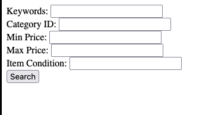

# eBay Item Search API Application

## Overview

This application is a web-based interface that allows users to search for items on eBay using the eBay Finding API. It's built with Flask and provides a simple form interface for searching eBay's marketplace based on keywords and various optional filtering criteria.

## Features

- **eBay API Integration**: Connects to eBay's Finding API to search for items
- **Token Authentication**: Implements OAuth 2.0 authentication with automatic token refresh
- **Search Capabilities**:
  - Keyword-based search
  - Category filtering
  - Price range filtering (min/max)
  - Item condition filtering
- **Web Interface**: Simple HTML form for submitting search parameters
- **JSON Results Display**: Shows formatted JSON results from the eBay API

## Technical Stack

- **Backend**: Python with Flask web framework
- **API Communication**: Requests library for HTTP calls
- **Authentication**: OAuth 2.0 with client credentials flow
- **Environment Variables**: Secure storage of API credentials
- **Deployment**: Configured for cloud deployment via Replit

## How It Works

1. **Authentication Flow**:
   - The application securely stores eBay API credentials in Replit Secrets
   - It obtains an OAuth access token using the client credentials grant
   - The token is automatically refreshed when expired

2. **Search Process**:
   - User inputs search parameters in the web form
   - Application validates the access token and refreshes if necessary
   - The search query is constructed with user-provided filters
   - Application sends the request to eBay's Finding API
   - Results are displayed in formatted JSON

3. **API Integration**:
   - Uses eBay's Sandbox environment for testing
   - Implements the `findItemsByKeywords` operation
   - Supports filtering by category, price range, and item condition

## Setup and Configuration

### Prerequisites

- eBay Developer Account
- Application keys from the eBay Developer Program
- Replit account

### Environment Variables

The application requires the following environment variables to be set in Replit Secrets:

- `EBAY_CLIENT_ID`: Your eBay application client ID
- `EBAY_CLIENT_SECRET`: Your eBay application client secret

### Running the Application

The application is configured to run automatically on Replit:

1. The Flask server runs on host `0.0.0.0` and port `8080`
2. Debug mode is enabled for development purposes

## Usage

1. Access the web interface through your Replit URL
2. Fill in the search form with the following parameters:
   - **Keywords**: Main search terms (required)
   - **Category ID**: eBay category identifier (optional)
   - **Min Price**: Minimum price filter (optional)
   - **Max Price**: Maximum price filter (optional)
   - **Item Condition**: Filter by item condition (optional)
3. Click "Search" to submit the query
4. View the formatted JSON results

## API Reference

### eBay Finding API

This application uses the eBay Finding API, specifically:
- API Endpoint: `https://svcs.sandbox.ebay.com/services/search/FindingService/v1`
- Operation: `findItemsByKeywords`
- Service Version: `1.0.0`
- Response Format: JSON

### Authentication API

OAuth 2.0 authentication is implemented using:
- API Endpoint: `https://api.sandbox.ebay.com/identity/v1/oauth2/token`
- Grant Type: `client_credentials`
- Scope: `https://api.ebay.com/oauth/api_scope`

## Development Notes

- The application currently uses eBay's Sandbox environment for testing
- To use the production environment, update the API endpoints
- The token refresh mechanism automatically handles token expiration
- For production use, implement proper error handling and user feedback

## Limitations

- Basic UI with minimal styling
- Limited error handling in the current implementation
- Results displayed as raw JSON (could be enhanced with structured display)
- Currently only implements the basic finding functionality

## Future Enhancements

- Improved UI with structured item display
- Pagination of search results
- Advanced filtering options
- Item detail views
- User favorites or watch lists
- Integration with eBay's Shopping API for additional functionality

## License

This project is for educational and demonstration purposes.

## Credits

Built with Flask and the eBay Developer API.
